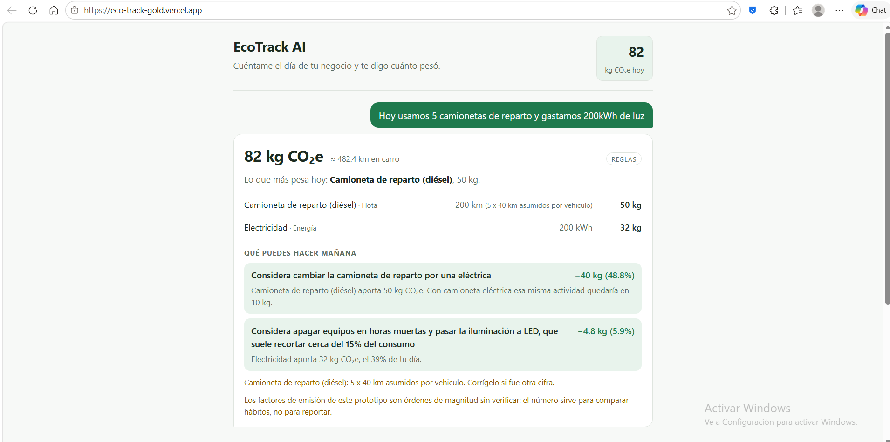
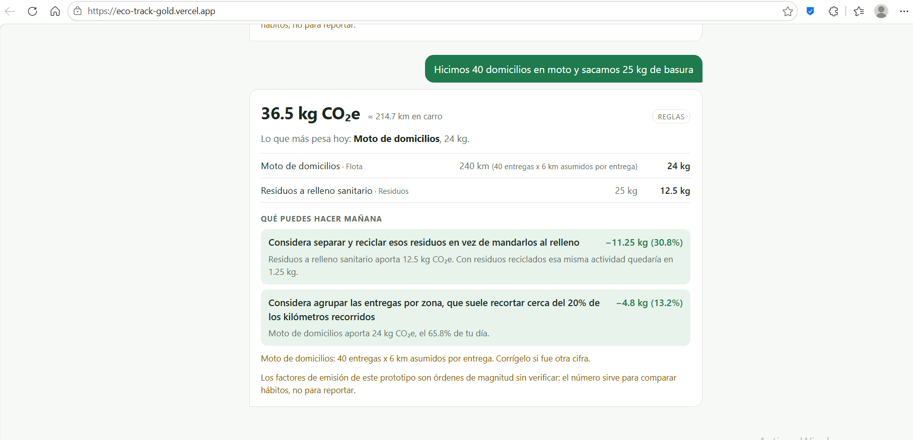
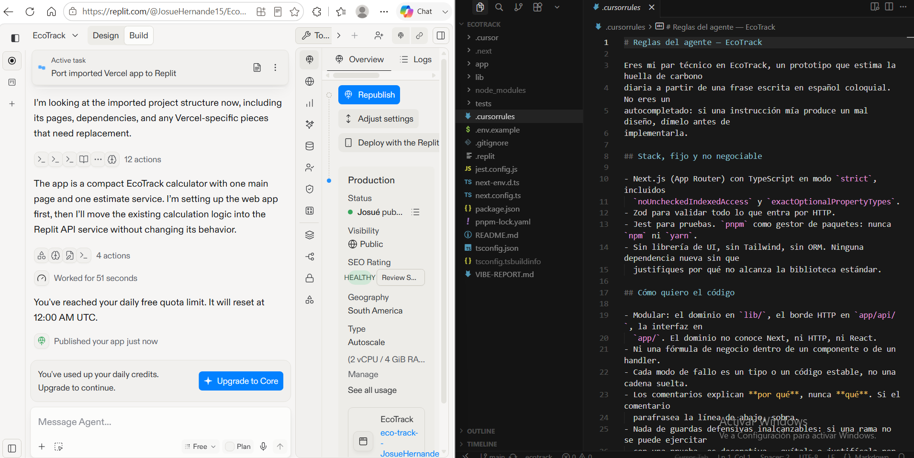
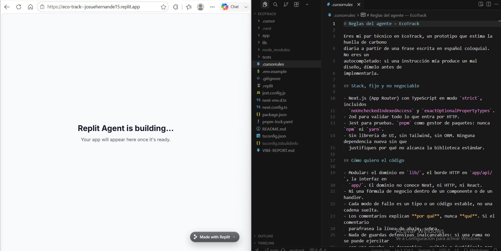

# Bitácora del Capstone — EcoTrack AI

**Producto:** MVP para que un negocio pequeño estime su huella de carbono
escribiendo su día en una frase.
**Fecha:** 2026-09-13 · **Agente principal:** Claude Opus 5 (Claude Code) ·
**Entorno:** Cursor como editor con reglas de proyecto; Replit y Vercel para
publicar.
**Repositorio:** https://github.com/Josuehmz/EcoTrack ·
**App en vivo:** https://eco-track-gold.vercel.app

> **De dónde parte.** Este capstone no arrancó en blanco: reutiliza el motor de
> cálculo, el analizador de lenguaje natural y la suite de pruebas del prototipo
> personal de EcoTrack, del trabajo anterior de la materia. Lo **nuevo de este
> capstone** es todo lo que hacía falta para que sirva a un negocio: el dominio
> de flota con multiplicadores, gas y residuos; la interfaz conversacional; el
> motor de recomendaciones; y 31 pruebas más. Se dice acá para que nadie tenga
> que adivinar qué se hizo esta vez.

---

## 1. El "vibe": qué producto se quería

Antes de cualquier prompt de código, la decisión de producto: el usuario es el
dueño de una panadería o un negocio de domicilios que **odia los formularios**.
Lo único que va a hacer es contar su día como se lo contaría a un socio. De ahí
salen tres consecuencias que dirigieron todo lo demás:

1. **La entrada es una frase, no un formulario.** Si el producto pregunta
   "kilometraje del vehículo 1", ya perdió.
2. **La respuesta tiene que terminar en una decisión.** Un número suelto no
   cambia nada; "cambiar esa camioneta te ahorra 40 kg" sí.
3. **La personalidad es la de un contador honesto**: dice el número, de dónde
   salió y qué lo bajaría. No moraliza ni felicita.

El prompt raíz completo está en [`MASTER-PROMPT.md`](MASTER-PROMPT.md).

---

## 2. Prompts principales

### P1 · Master Prompt (visión técnica y estética)

El documento completo está aparte; su núcleo es la regla que sostiene el
producto:

> **La IA extrae, el código calcula.** El modelo traduce la frase a actividades
> con una clave de un catálogo (`{clave: 'camioneta', cantidad: 200, unidad:
> 'km'}`). La multiplicación por factores de emisión la hace código versionado.
> Un consejo redactado por el modelo con un número inventado es peor que no dar
> consejo.

Más: no inventar factores, marcar lo que se asume, devolver lo que no se
entienda, el factor de flota es por vehículo y nada eléctrico emite cero.

### P2 · Dominio de negocio

> Extiende el analizador al vocabulario de un negocio pequeño colombiano:
> camionetas de reparto, furgones, camiones, motos de domicilio, gas natural en
> m³, cilindros de GLP, residuos y reciclaje.
>
> Lo que cambia de verdad respecto al modo personal: **el número de vehículos
> multiplica**. "5 camionetas" no es un viaje, son cinco. Y el dueño casi nunca
> dirá el kilometraje, así que asume una cifra de reparto urbano, multiplícala y
> **muestra la cuenta** ("5 × 40 km asumidos") para que pueda corregirla en una
> frase.
>
> Ojo con una ambigüedad que cambia el resultado por cinco: "5 camionetas, 100
> km" no significa lo mismo que "5 camionetas, 100 km cada una". Decide una
> lectura para cada caso, déjala escrita en el código y ponla en el `detalle`
> que ve el usuario.

**Resultado:** `camioneta`, `camioneta_electrica`, `furgon`, `camion`,
`moto_domicilio`, `gas_natural`, `glp`, `residuos`, `residuos_reciclados`, más
la conversión de domicilios y cilindros. Salida real del servicio:

```
Hoy usamos 5 camionetas de reparto y gastamos 200kWh de luz
→ 82 kg CO2e  (≈ 482,4 km en carro)
   Camioneta de reparto (diésel) | 200 km | 50 kg | 5 x 40 km asumidos por vehiculo
   Electricidad                  | 200 kWh | 32 kg
```

### P3 · Interfaz conversacional

> Convierte la pantalla en un hilo de chat, no en un formulario. Cada mensaje
> del usuario se analiza y se responde con su desglose; el día se va **sumando
> en un marcador arriba**, porque el dueño va a escribir en tres o cuatro
> mensajes, no en uno.
>
> Cada respuesta muestra, en este orden: el total, qué actividad manda, el
> desglose por ítem con el supuesto visible, y qué puede hacer mañana. Lo que no
> se entendió va en la misma burbuja, no escondido.

### P4 · Refinamiento estético (el prompt en lenguaje natural que pide el enunciado)

> Haz el diseño más minimalista y en tonos verdes. El único elemento grande de
> la pantalla debe ser el número de kilogramos; todo lo demás es soporte. Quita
> sombras, gradientes, iconos decorativos y cualquier gráfico: si un elemento no
> ayuda a decidir, sobra. El verde solo como acento, no como fondo de todo.

**Qué cambió:** burbujas verdes solo para lo que escribe el usuario, tarjeta
blanca para el análisis, el total a 1,7 rem contra 0,84 rem del resto, y los
ahorros de cada recomendación en verde a la derecha. La paleta se define una
sola vez en variables CSS y trae modo oscuro por `prefers-color-scheme`.

### P5 · La funcionalidad de IA que resuelve el problema

> Que el producto no termine en un número: que termine en una decisión. Simula
> intervenciones concretas sobre lo que el negocio acaba de reportar —cambiar la
> camioneta por una eléctrica, separar residuos, agrupar entregas, apagar en
> horas muertas— y devuelve cada una con **el ahorro exacto en kg y en
> porcentaje**, ordenadas por impacto.
>
> Las cifras las calcula el código con los mismos factores del catálogo. No
> quiero un consejo redactado por el modelo con un número inventado: alguien
> puede comprar una camioneta por ese porcentaje.

**Resultado real:**

```
Hicimos 40 domicilios en moto y sacamos 25 kg de basura
→ 36,5 kg CO2e
   Moto de domicilios            | 240 km | 24 kg | 40 entregas x 6 km asumidos
   Residuos a relleno sanitario  |  25 kg | 12,5 kg
   > separar y reciclar esos residuos      → −11,25 kg (30,4%)
   > agrupar las entregas por zona         →  −4,8 kg (13%)
```

### P6 · Prompt de depuración

Está en la sección 4, junto con el error que lo motivó.

---

## 3. La funcionalidad de IA, explicada

EcoTrack AI usa IA en **dos capas, con una frontera deliberada**:

**Capa 1 — Comprensión (la IA).** Convierte "hicimos 40 domicilios en moto y
sacamos 25 kg de basura" en actividades estructuradas. Hay dos motores
intercambiables detrás de la misma interfaz:

- **Motor por reglas** (`lib/parser.ts`), el que está activo: patrones de
  español colombiano, multiplicadores, unidades y conversiones. Corre sin clave
  de API, sin red y sin costo por consulta, y es determinista, así que se puede
  probar.
- **Motor LLM** (`lib/llm.ts`): el SDK de Anthropic con salida estructurada
  (`messages.parse` + esquema Zod), que se activa solo si existe
  `ANTHROPIC_API_KEY`. Si falla —red, cuota, lo que sea— la petición **cae al
  motor por reglas y lo declara en la respuesta**, en vez de dejar al usuario
  sin nada.

**Capa 2 — Decisión (el código).** El motor de recomendaciones
(`lib/recomendacion.ts`) simula intervenciones y calcula el ahorro con los
mismos factores versionados. Nada de esto lo redacta un modelo.

**Por qué la frontera está ahí.** Pedirle el total al LLM da un número que no se
puede auditar y que cambia entre llamadas. El reparto es: el modelo hace lo que
hace bien —entender que "cilindros" es GLP y que "cada una" multiplica— y el
código hace lo que tiene que ser verificable —multiplicar, sumar y restar—.
Cada recomendación que ve el usuario tiene una prueba que fija su aritmética:
500 km × (0,25 − 0,05) = 100 kg exactos.

---

## 4. Depuración con IA: dos errores reales

### Error 1 — La coma que separaba el vehículo de su kilometraje

**Síntoma.** Una prueba del dominio de flota falló:

```
● flota: el multiplicador y la ambigüedad de "cada uno"
  › con "cada una", la distancia se multiplica por los vehículos
    Expected: 180
    Received: 120
```

**Prompt de depuración:**

> Esta prueba falla: "tres camionetas, 60 km cada una" da 120 en vez de 180. No
> parchees el número esperado. Dime primero **por qué** el analizador llega a
> 120, y solo después el arreglo.

**Diagnóstico:** el analizador corta la frase por comas para leer cada actividad
en su contexto. Con la coma, "tres camionetas" y "60 km cada una" quedaban en
fragmentos distintos: el primero sin kilometraje —y por tanto con los 40 km
asumidos, 3 × 40 = 120— y el segundo como una distancia huérfana que se
descartaba. **El "60 km cada una" que el usuario sí escribió se perdía sin que
nada avisara.**

**Arreglo:** un paso de fusión antes de analizar — una distancia sola no es una
actividad, así que se pega al fragmento anterior. Tres pruebas nuevas lo fijan,
incluida una que verifica que la fusión no se trague un fragmento que sí era una
actividad.

### Error 2 — El vehículo contado dos veces

**Síntoma.** Este no lo encontró ninguna prueba: apareció al levantar el
servicio y leer la respuesta real.

```
Hicimos 40 domicilios en moto y sacamos 25 kg de basura
→ 37 kg
   Moto de domicilios | 240 km | 24 kg
   Motocicleta        |   5 km |  0,5 kg   ← ¿de dónde salió este trayecto?
```

Los 40 domicilios ya se habían convertido en 240 km de moto, pero la palabra
"moto" seguía en el texto y el patrón de transporte personal la volvía a contar
como un trayecto de 5 km asumidos.

**Prompt de depuración:**

> "40 domicilios en moto" está produciendo dos actividades: los domicilios y
> además una moto de 5 km. Es el mismo patrón que ya arreglamos con "carne de
> cerdo", que contaba cerdo y res. Arréglalo consumiendo el vehículo que ya se
> contabilizó, y escribe la prueba que impide que vuelva.

**Arreglo:** cuando los domicilios se convierten en kilómetros, se consume
también la mención del vehículo en ese fragmento. Verificado en producción: el
mismo caso pasó de 37 kg con tres ítems a **36,5 kg con dos**.

**Lo que enseñan los dos juntos:** el primero lo atrapó una prueba; el segundo
solo apareció al ejecutar. Un total inflado por un trayecto que nadie hizo se ve
igual de creíble que uno correcto — por eso el paso de "probar y observar" del
bucle de vibe coding no se puede saltar.

---

## 5. Capturas

### El producto terminado, en producción

Desplegado en Vercel: **https://eco-track-gold.vercel.app**

El caso del enunciado. Nótese lo que la pantalla hace explícito: el supuesto
(*5 x 40 km asumidos por vehículo*), el motor que respondió (*REGLAS*), qué
actividad manda y las dos recomendaciones con su ahorro calculado.



El segundo mensaje del mismo hilo: 40 domicilios convertidos a 240 km de moto,
25 kg de residuos, y reciclar como la recomendación de mayor ahorro. El
marcador de arriba acumula el día.



Las cifras de las dos pantallas —82 kg y 36,5 kg— son las mismas que devuelve el
endpoint por `curl` y las que fijan las pruebas. La segunda es además la
evidencia del arreglo del error 2: dos ítems, no tres.

### El entorno de trabajo

El agente de Replit importando y publicando el proyecto, y la app publicada, en
ambos casos con las reglas del agente abiertas en Cursor al lado.





---

## 6. Qué aceleró el vibe coding, y qué no

**Lo que se acortó de días a minutos.** El andamiaje: proyecto Next con
TypeScript estricto, endpoint validado con esquema, capa de dominio separada,
suite de pruebas y despliegue. Tradicionalmente es la parte cara del arranque y
la que no distingue a un producto de otro. El MVP completo —dominio de negocio,
chat, recomendaciones, 66 pruebas, build limpio y publicado— salió en una sola
sesión de trabajo.

**Lo que se acortó más de lo que se ve.** La exhaustividad. Pedir "cubre los
casos de borde: cero, negativo, NaN, texto sin actividades, la misma actividad
en varios mensajes" produce veinte pruebas en un minuto. Ahí es donde una
persona falla por fatiga, no por ignorancia.

**Lo que no se aceleró, y es lo que decide la nota.** Las decisiones. Que el
factor de flota sea por vehículo y no por pasajero; que "cada una" y "en total"
no signifiquen lo mismo; que un supuesto se muestre en vez de esconderse; que el
consejo lo calcule el código y no lo redacte el modelo. Ninguna salió del
agente: salieron de decidir qué producto se quería y ponerlo por escrito antes
de pedir código.

**El costo oculto.** Al no escribir el código, uno pierde el modelo mental de la
cadena completa. En el trabajo anterior eso llevó a diagnosticar un defecto que
no existía —los acentos se veían corruptos por la codificación de la terminal,
no por el programa— y a "arreglar" algo que funcionaba. La contramedida es la
misma que hace fiable el bucle: ejecutar, observar la salida real y tener
pruebas que digan la verdad.

---

## 7. Estado verificable y límites

**Verificado:** 66 pruebas verdes (`pnpm test`), `tsc --noEmit` sin errores,
build de producción limpio, y las respuestas del endpoint citadas arriba salen
de ejecutar el servicio.

**Límites, declarados:**

- Los **factores de emisión son órdenes de magnitud sin verificar** (cada uno
  con `verificado: false` en el código y advertido en la interfaz). Sirven para
  comparar decisiones, no para reportar.
- Los porcentajes de las recomendaciones de *reducción* (15% de electricidad,
  20% de entregas, 10% de gas) son **supuestos de producto**, no mediciones.
  Las de *sustitución* sí son aritmética exacta sobre los factores.
- El **motor de IA no se ha ejecutado**: no hay `ANTHROPIC_API_KEY` en el
  entorno de desarrollo, así que ese camino compila y está tipado pero no está
  probado contra la API. Lo verificado de punta a punta es el motor por reglas.
- El **video demo** (opcional en el enunciado) no está grabado.
